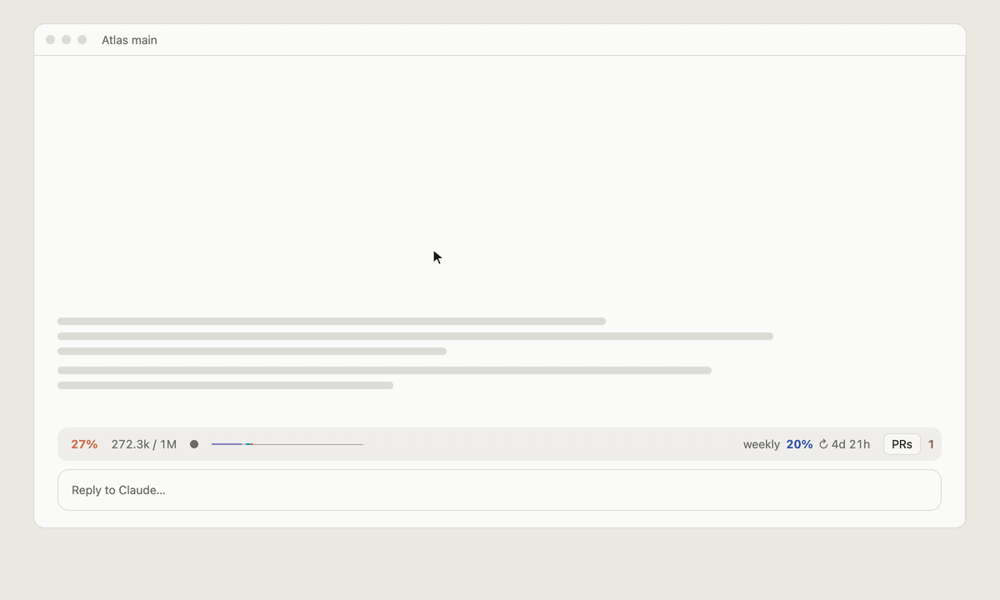
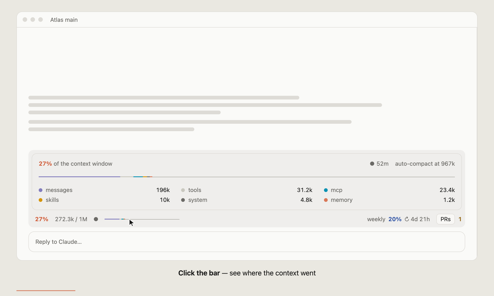
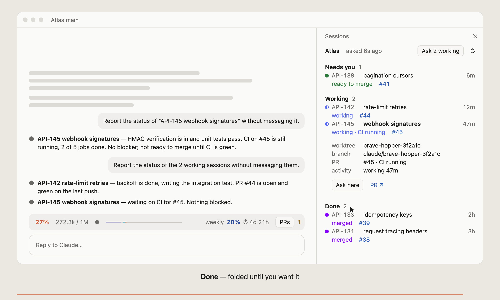

# Claude Code Cockpit

Two mods for [Claude Code](https://claude.com/claude-code) for people who run many sessions at once: one line above the prompt that tells you what this session is costing, and one pane beside the chat that tells you what every other session is doing.

<picture>
  <source media="(prefers-color-scheme: dark)" srcset="docs/demo-dark.gif">
  
</picture>

Unofficial. Not affiliated with Anthropic.

## What you get

### `context-card`: one line above the prompt

<picture>
  <source media="(prefers-color-scheme: dark)" srcset="docs/card-dark.png">
  
</picture>

| On the line | Meaning |
| --- | --- |
| `27%` `272.3k / 1M` | How full the context window is. Turns amber at 60%, red at 80%. |
| `●` `◐` `○` | The prompt cache: fresh, past half its life, expired. Sending a message on an expired cache re-reads the whole context at full price. |
| The thin bar | The same percentage, colored by what is using it. |
| `weekly 20% ↻ 4d 21h` | Your plan's weekly usage and when it resets, read live from your account. |
| `PRs` | Opens the sessions pane. A number beside it counts sessions waiting on you. |

Click anywhere on the line to open the breakdown (messages, tools, MCP, skills, system, memory), the cache's minutes left, and where auto-compact will run. Click again to close it.

### `pr-pane`: the sessions pane

<picture>
  <source media="(prefers-color-scheme: dark)" srcset="docs/sessions-dark.png">
  
</picture>

Every session in the same sidebar group, sorted by what it needs from you:

| Section | What is in it |
| --- | --- |
| **Needs you** | CI failing, conflicts, changes requested, ready to merge, or idle with nothing to show. |
| **Working** | Sessions running right now. |
| **Done** | Merged or closed. Folded until you click the heading. |
| **Loose worktrees** | Worktrees no session holds, and whether they have uncommitted changes. |

Each row has one time, on the right: how long it has been in the state its status names (`working` for 47m, `merged` 2h ago).

| Control | What it does |
| --- | --- |
| Click a session | Shows its worktree, branch, PR and activity. |
| **Ask here** | Asks, in the session you are in, for that session's status. Claude reads the other session's transcript and checks its PR; the other session is not messaged or interrupted. |
| **Ask N working** | The same, for every session that is running. |
| `#45`, `PR ↗` | Opens the pull request on GitHub. |
| `↻` | Refreshes now. The pane also refreshes itself every 15 seconds. |
| A section heading | Folds or unfolds the section. |

Outside any project, the pane shows every project's sessions as one overview.

## Install

Both mods together, from this repository:

```
/plugin marketplace add Nongfsq/frank-claude-cockpit
/plugin install context-card@frank-claude-cockpit
/plugin install pr-pane@frank-claude-cockpit
```

Or copy the two folders into `~/.claude/skills/` and start a new session:

```bash
git clone https://github.com/Nongfsq/frank-claude-cockpit
cp -R frank-claude-cockpit/context-card frank-claude-cockpit/pr-pane ~/.claude/skills/
```

Install both: the `PRs` button lives in `context-card` and appears only when `pr-pane` is present.

## Requirements

- **A recent Claude Code.** These mods use the hooks-module API (`ui.render`, `$.state`); they were built and tested on 2.1.286.
- **`context-card`'s weekly usage** needs a Claude subscription login. With an API key the card still shows context, without the weekly figure.
- **`pr-pane`** needs the Claude desktop app, which is where the session list comes from; in a plain terminal it says the list is unavailable. PR and CI state come from the [`gh`](https://cli.github.com) CLI, logged in.

## What leaves your machine

- `context-card` asks `api.anthropic.com` for your own plan usage, once a minute, with the login Claude Code already holds. That request uses no tokens.
- `pr-pane` runs `git` and `gh` locally, in the project's folder.
- **Ask here** sends one prompt in your current session, so it costs what a prompt costs there.

Nothing else is sent anywhere.

## Development

```bash
claude plugin validate context-card
claude plugin test context-card
claude plugin test pr-pane
```

Types for an editor: run `/plugin-types` inside a mod's folder.

The demo above is a scripted page, [`docs/demo/index.html`](docs/demo/index.html); open it in a browser to watch it loop, or add `?theme=light`. To re-record it:

```bash
cd docs/demo && npm i puppeteer-core
node record.mjs frames dark 15
ffmpeg -framerate 15 -i frames/f%04d.png -vf "scale=1200:-1:flags=lanczos,split[a][b];[a]palettegen=max_colors=128:stats_mode=diff[p];[b][p]paletteuse=dither=bayer:bayer_scale=5:diff_mode=rectangle" ../demo-dark.gif
```

## License

[MIT](LICENSE)
